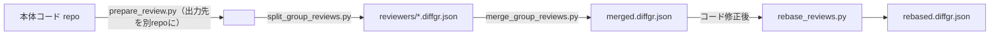

# DiffGR

DiffGR は、大きい差分を「レビューしやすい単位」に分割し、レビュー状態とコメントを JSON に蓄積するためのツールセットです。  
このリポジトリでは、生成・分割・AIブラッシュアップ・対話レビュー・HTML共有までを一通り実行できます。

## 1. できること

- Git の `base` / `feature` から `*.diffgr.json` を生成
- 変更を仮想PR（グループ）に自動分割
- AI 提案（rename/move）で分割をブラッシュアップ
- Textual アプリでレビュー状態とコメントを編集
- HTML レポートを出力し、ローカルサーバ経由で `reviews / groupBriefs / analysisState / threadState` を直接保存

## 2. リポジトリ構成

- `scripts/`: 実行用 CLI
- `diffgr/`: コア実装（生成、分割、UI、HTML、AI連携）
- `docs/アプリの使い方.md`: 実運用向けの詳細手順
- `DiffGR_v1_仕様書.md`: DiffGR JSON 形式の仕様
- `samples/`: サンプル入力/出力
- `tests/`: `unittest` ベースのテスト

## 3. セットアップ

依存:

- `rich`
- `textual`
- `rapidfuzz`
- `diff-match-patch`

### `.venv` がある場合（推奨）

リポジトリに `.venv/` が同梱されている場合は、そちらをそのまま使えます。

```bash
# macOS / Linux
source .venv/bin/activate
python scripts/view_diffgr_app.py samples/diffgr/realistic-acme-tasks.diffgr.json --ui textual
```

```powershell
# Windows (PowerShell)
.venv\Scripts\Activate.ps1
python scripts\view_diffgr_app.py samples\diffgr\realistic-acme-tasks.diffgr.json --ui textual
```

### `.venv` がない場合

新たに仮想環境を作成してから依存をインストールします。

```bash
# macOS / Linux
python3 -m venv .venv
source .venv/bin/activate
pip install -r requirements.txt
```

```powershell
# Windows (PowerShell)
python -m venv .venv
.venv\Scripts\Activate.ps1
pip install -r requirements.txt
```

## 4. 最短クイックスタート

```powershell
# 1) 生成→自動分割→分割名改善（1コマンド）
python scripts\prepare_review.py `
  --base samples/ts20-base `
  --feature samples/ts20-feature-5pr `
  --output samples/diffgr/ts20-5pr.review.diffgr.json `
  --title "DiffGR review bundle"

# 2) Textual UI で確認
python scripts\view_diffgr_app.py samples/diffgr/ts20-5pr.review.diffgr.json --state out\state\review-state.json --ui textual

# 3) HTML レポート共有（直接保存あり）
python scripts\serve_diffgr_report.py `
  --input samples/diffgr/ts20-5pr.review.diffgr.json `
  --group all `
  --open
```

### 4.1 追加サンプル（より実践的なファイル名/差分）

`ts20-*` は学習用に規則的な差分が多いため、より実践的な混在差分サンプルも同梱しています。

```powershell
python scripts\view_diffgr_app.py samples/diffgr/realistic-acme-tasks.diffgr.json --ui textual
```

## 5. 標準ワークフロー

### 5.1 DiffGR を生成

```powershell
python scripts\generate_diffgr.py `
  --base <base_ref> `
  --feature <feature_ref> `
  --output out\work\01.diffgr.json `
  --title "DiffGR Review Bundle"
```

### 5.2 自動分割

```powershell
python scripts\autoslice_diffgr.py `
  --base <base_ref> `
  --feature <feature_ref> `
  --input out\work\01.diffgr.json `
  --output out\work\02.autosliced.diffgr.json
```

### 5.3 分割名改善 + AI入力プロンプト作成

```powershell
python scripts\refine_slices.py `
  --input out\work\02.autosliced.diffgr.json `
  --output out\work\03.refined.diffgr.json `
  --write-prompt out\work\03.refine-prompt.md
```

## 6. AIブラッシュアップ込みワークフロー

AI には `slice_patch.json`（rename/move）を作らせ、最後に適用します。

```powershell
# 1) AIにパッチJSONを作らせる
python scripts\run_agent_cli.py `
  --config agent_cli.toml `
  --prompt out\work\03.refine-prompt.md `
  --output out\work\04.slice_patch.json `
  --interactive

# 2) 適用
python scripts\apply_slice_patch.py `
  --input out\work\03.refined.diffgr.json `
  --patch out\work\04.slice_patch.json `
  --output out\work\05.ai-refined.diffgr.json

# 3) 確認
python scripts\view_diffgr_app.py out\work\05.ai-refined.diffgr.json --ui textual
```

補足:

- `run_agent_cli.py` は `agent_cli.toml` の設定と、対応 CLI（Codex または Claude）が必要です。
- `slice_patch.json` が不正な場合は `apply_slice_patch.py` で失敗します。

## 7. Textual アプリの要点

起動:

```powershell
python scripts\view_diffgr_app.py <path-to.diffgr.json> --ui textual
```

外部 state を重ねて開きたい場合は `--state <review-state.json>` を付けます。

`--ui prompt` の最小操作:

- `set-status <chunk_id> <status>`
- `comment <chunk_id> <text|clear>`
- `line-comment <chunk_id> <old|-> <new|-> <type> <text|clear>`
- `brief <group_id> <summary|clear>`
- `brief-status <group_id> <status|clear>`
- `brief-meta <group_id> <updatedAt|sourceHead> <value|clear>`
- `brief-list <group_id> <focus|evidence|tradeoff|question> <item1 | item2 | clear>`
- `brief-mentions <group_id> <mention1 | mention2 | clear>`
- `brief-ack <group_id> <actor;at;note | clear>`
- `detail <chunk_id>` / `brief-show <group_id>`
- `state-show`
- `state-bind <path>` / `state-unbind`
- `state-load <path>`
- `state-diff <path>`
- `state-merge <path>`
- `state-merge-preview <path>`
- `impact-merge-preview <old.diffgr.json> <new.diffgr.json> <state.json?>`
- `impact-apply-preview <old.diffgr.json> <new.diffgr.json> <state.json?> <handoffs|reviews|ui|all>`
- `impact-apply <old.diffgr.json> <new.diffgr.json> <state.json?> <handoffs|reviews|ui|all>`
- `state-apply-preview <path?> <selection...>`
- `state-apply <path?> <selection...>`
- `state-reset`
- `state-save-as <path>`
- `save`

`--state` を付けた prompt UI は `group/file/status` フィルタと最後に見た `chunk` を `analysisState` に保存します。
`state-bind` で prompt セッション中の既定 state JSON を切り替えられます。`state-load` / `state-diff` / `state-merge` / `state-merge-preview` / `state-save-as` / `state-apply-preview` / `state-apply` は `--state` 付き、または `state-bind` 済みなら、引数省略でそのバインド先を対象にできます。`save` も同じ bound path があれば元 `.diffgr.json` ではなくその state JSON に保存します。preview report は `Source / Change Summary / Warnings / Group Brief Changes / State Diff` を共通語彙にし、impact preview ではこれに `Impact / Affected Briefs / Selection Plans` が追加されます。`impact-apply-preview` は impact preview から `handoffs / reviews / ui / all` の selection plan を選んで rebased selective apply を preview し、`impact-apply` はその plan を current session state に適用します。`state-apply-preview` は selection token の no-op/changed section を事前確認し、`state-apply` は `reviews:c1` や `analysisState:selectedChunkId` の token で選択適用します。

主要操作:

- `Space`: done/undone トグル（`reviewed` <-> `unreviewed`）
- `Shift+Space`: done（`reviewed`）
- `Backspace` または `1`: undone（`unreviewed`）
- `b`: 現在の group の `Review Handoff` を編集（summary / focus points / test evidence / tradeoffs / questions）
- `Shift+B`: 現在の group の `Review Handoff` status を `draft -> ready -> acknowledged -> stale` で切替
- `m`: コメント編集（行選択時は行コメント）
- `o`: 実ファイルを外部エディタで開く
- `t`: 設定画面（`editor mode` / `diff syntax` / `ui density`）
- `d`: グループ差分レポート表示切替
- `v`: チャンク詳細表示切替（compact / side-by-side）
- `z`: Focus Changes（未変更行＝context を隠して「変更点だけ」に集中）
- `Shift+T`: コードのシンタックステーマ切替（Pygments）
- `=` / `-`: 表示のズーム相当（ui density 切替: compact/normal/comfortable）
- `s`: 保存
- `h`: HTML エクスポート
- `Shift+H`: state JSON エクスポート（`out/state/*.state.json`）
- `Shift+I`: state JSON インポート
- `Ctrl+B`: state JSON を bind
- `Ctrl+U`: state bind を解除
- `Ctrl+D`: bound state と現在 state の diff summary
- `Ctrl+Shift+D`: old/new DiffGR + state で impact-aware preview を表示
- `Ctrl+Alt+D`: bound state に対する full merge preview を表示
- `Ctrl+M`: bound state を現在 state に merge
- `Ctrl+Shift+M`: bound state から selection token 単位で適用

`o` のエディタ設定:

- `editor mode`: `auto` / `vscode` / `cursor` / `default-app` / `custom`
- `diff syntax`: `on` / `off`（rich Syntax / Pygments による色分け）
- `diff syntax theme`: `github-dark` など（Pygments のスタイル名。`Shift+T` で循環）
- `ui density`: `compact` / `normal` / `comfortable`
- 設定保存先: `~/.diffgr/viewer_settings.json`（環境変数 `DIFFGR_VIEWER_SETTINGS` で変更可）

補足:

- Textual UI の「フォントサイズ」自体は **端末側の設定**です（アプリからは変更できません）。  
  代わりに `ui density`（セル余白）で見た目の密度を調整できます。

## 8. HTML レポート

### 8.1 静的HTMLを出力

```powershell
python scripts\export_diffgr_html.py `
  --input out\work\05.ai-refined.diffgr.json `
  --state out\state\review-state.json `
  --impact-old out\work\03.refined.diffgr.json `
  --impact-state out\state\review-state.json `
  --group all `
  --output out\reports\review.html `
  --open
```

### 8.2 ローカルサーバで直接保存

```powershell
python scripts\serve_diffgr_report.py `
  --input out\work\05.ai-refined.diffgr.json `
  --state out\state\review-state.json `
  --impact-old out\work\03.refined.diffgr.json `
  --impact-state out\state\review-state.json `
  --group all `
  --open
```

この方式では、HTML の `Save State` で `reviews / groupBriefs / analysisState / threadState` が保存されます。`--state` を付けない場合は元 JSON に直接保存し、`--state` を付けた場合は外部 state JSON に保存します。`Download State` / `Copy State` / `Import State` / `Diff State` / `Apply Selected State` は同じ state payload を扱い、toolbar の state source には `embedded` / `overlay:<file>` / `imported:<file>` が表示されます。`Diff State` は alert ではなく modal で token を見られ、`Copy Tokens` と `Apply These Tokens` でそのまま selective apply に渡せます。`Diff State` / `Apply Selected State` / `Impact Preview > State Diff` は同じ section order と count semantics を使い、`threadState.__files:*` も file-level token のまま表示されます。`Apply Selected State` は textarea に token を貼ってすぐ適用するのではなく、`Preview` で `selected / no-op / changed-sections / State Diff` を確認してから `Apply` する 2 段階です。Textual でも `Ctrl+D` で token 付き diff を見てから `Ctrl+Shift+M` を開くと、その token 群が初期値に入り、`Ctrl+Shift+D` 後は `@handoffs / @reviews / @ui / @all` で impact selection plan を展開できます。`Ctrl+Alt+M` なら plan 名だけで direct impact apply preview/apply に進めます。`@plan` は impact preview の rebased state を参照するので、明示 token と混在させません。`--impact-old` と `--impact-state` を両方付けた場合だけ read-only の `Impact Preview` が出て、Python core の preview report をそのまま使って `source=old -> new using state` を表示します。HTML の `Apply These Tokens` は current state source が同じ impact state のときだけ有効で、plan row から直接 preview/apply modal に進み、その preview には `source=impact:<plan>` と `base=<imported state>` が出ます。`analysisState` にはフィルタや表示設定、`threadState` には file/chunk の開閉状態が入ります。

HTML レポートの見やすさ調整:

- ツールバーの `A-` / `A+` / `A0` で diff 本文のフォントサイズを変更できます（ブラウザの `localStorage` に保存）。

## 9. 主な CLI 一覧

- `scripts/generate_diffgr.py`: DiffGR 生成
- `scripts/autoslice_diffgr.py`: 自動分割
- `scripts/refine_slices.py`: 分割名改善 + AIプロンプト出力
- `scripts/check_virtual_pr_coverage.py`: 仮想PR割当が全chunkを網羅しているか検査（AI修正プロンプト生成可）
- `scripts/run_agent_cli.py`: AI で slice patch 生成
- `scripts/apply_slice_patch.py`: slice patch 適用
- `scripts/split_group_reviews.py`: 仮想PR単位のレビューファイル分割
- `scripts/merge_group_reviews.py`: 分割レビューファイルの結果を本体へマージ
- `scripts/rebase_reviews.py`: コード修正後の新DiffGRへレビュー状態を引き継ぐ（未変更は維持、変更はneedsReReview）
- `scripts/summarize_diffgr.py`: DiffGR JSON の進捗/網羅/出所（SHA含む）をサマリ表示
- `scripts/extract_diffgr_state.py`: `reviews / groupBriefs / analysisState / threadState` を state JSON として抽出
- `scripts/diff_diffgr_state.py`: 2つの state JSON の差分（added/removed/changed）を表示
- `scripts/diff_diffgr_state.py --tokens-only`: selection token だけを抽出
- `scripts/apply_diffgr_state_diff.py`: 2つの state JSON の差分から選択 token だけを適用
- `scripts/apply_diffgr_state_diff.py --preview`: 選択 token の適用結果を出力せずに確認
- `scripts/apply_diffgr_state_diff.py --impact-old --impact-new --impact-plan`: impact selection plan をそのまま適用/preview
- `scripts/summarize_diffgr_state.py`: state JSON の件数・status 分布・UI state を要約
- `scripts/merge_diffgr_state.py`: 複数の state JSON を deterministic に統合。`--preview` なら `--output` なしで summary だけ確認可能
- `scripts/preview_rebased_merge.py`: old/new DiffGR と state JSON から impact-aware merge preview を表示
- `scripts/apply_diffgr_state.py`: state JSON を DiffGR JSON に再適用
- `scripts/rebase_diffgr_state.py`: state JSON を old/new DiffGR 間で rebase
- `scripts/impact_report.py`: old/new 差分で「影響がある group / 影響がない group」を見える化（Markdown/JSON出力）
- `scripts/prepare_review.py`: 生成〜改善まで一括
- `scripts/view_diffgr_app.py`: 対話ビューア（`textual` / `prompt`）
- `scripts/export_diffgr_html.py`: 静的HTML出力
- `scripts/serve_diffgr_report.py`: HTML + 保存APIサーバ

## 10. 複数レビュア運用（仮想PR単位）

レビュアごとに担当グループを分けたい場合は、先に分割してからレビューし、最後にマージします。

```powershell
# 0) 事前チェック（未割当や重複があれば直す）
python scripts\check_virtual_pr_coverage.py --input out\work\05.ai-refined.diffgr.json

# 1) 仮想PR単位に分割
python scripts\split_group_reviews.py `
  --input out\work\05.ai-refined.diffgr.json `
  --output-dir out\reviewers

# 2) 各レビュアが担当ファイルを Textual でレビュー
python scripts\view_diffgr_app.py out\reviewers\01-<group>.diffgr.json --ui textual

# 3) 全員分を本体へマージ
python scripts\merge_group_reviews.py `
  --base out\work\05.ai-refined.diffgr.json `
  --input-glob "out/reviewers/*.diffgr.json" `
  --output out\work\06.merged-reviews.diffgr.json
```

注意:

- `--input-glob` には `*.diffgr.json` を使ってください（`manifest.json` は含めない）。
- 同じ chunk を複数ファイルが更新した場合、後から読み込んだファイルの内容で上書きされます。

## 11. 網羅チェック + AI修正（未割当/重複の自動修正）

`check_virtual_pr_coverage.py` が `2` で終了した場合、`--write-prompt` で AI 修正用の Markdown を作れます。

```powershell
python scripts\check_virtual_pr_coverage.py `
  --input out\work\05.ai-refined.diffgr.json `
  --write-prompt out\work\coverage-fix-prompt.md

python scripts\run_agent_cli.py `
  --config agent_cli.toml `
  --prompt out\work\coverage-fix-prompt.md `
  --output out\work\coverage-fix.slice_patch.json `
  --interactive

python scripts\apply_slice_patch.py `
  --input out\work\05.ai-refined.diffgr.json `
  --patch out\work\coverage-fix.slice_patch.json `
  --output out\work\05b.coverage-fixed.diffgr.json
```

## 12. レビュー後にコード修正した場合（再レビュー最小化）

レビューコメントを反映してコードを修正すると、chunk id が変わるため「前回の reviewed をそのまま使えない」ことがあります。  
`rebase_reviews.py` を使うと、`fingerprints.stable` ベースで同一chunkを認識し、未変更は `reviewed` を維持しつつ、変更されたものだけを `needsReReview` にできます。
さらに既定で、結果JSONの `meta.x-reviewHistory` にrebase履歴、`meta.x-impactScope` に影響範囲（影響あり/なしgroup）を記録します。
`meta.x-impactScope.coverageNew` は **rebase後の出力JSON** を基準に計算されます。

```powershell
# 1) 新しい差分スナップショットを作る（例: prepare_review を再実行）
python scripts\prepare_review.py `
  --base <base_ref> `
  --feature <new_feature_ref> `
  --output out\work\r2.review.diffgr.json `
  --title "DiffGR Review Bundle (round2)"

# 2) 前回レビュー済みの state を新スナップショットへ引き継ぐ
python scripts\rebase_reviews.py `
  --old out\work\05.ai-refined.diffgr.json `
  --new out\work\r2.review.diffgr.json `
  --output out\work\r2.rebased.diffgr.json

# 3) 網羅チェック（未割当/重複があれば修正）
python scripts\check_virtual_pr_coverage.py --input out\work\r2.rebased.diffgr.json
```

必要なら `--similarity-threshold` を下げると、テキストが少し変わったchunkも「同一とみなして needsReReview」に寄せられます。

## 13. よくあるハマりどころ

- Textual が起動しない  
  `python -m pip install -r requirements.txt` を再実行し、`--ui prompt` でも動くか確認してください。

- `t` で `textual` に切り替えたい  
  `t` は外部エディタ設定用です。UI切替は起動時の `--ui textual` です。

- `o` で VS Code が開かない  
  `t` で `editor mode=vscode` にして保存し、`code --version` が通ることを確認してください。

- HTML で保存が効かない  
  静的 HTML では自動保存されません。`serve_diffgr_report.py` 経由で開くか、`--save-state-url` を設定してください。

## 14. 参照ドキュメント

- 実運用手順: `docs/アプリの使い方.md`
- 仕様: `DiffGR_v1_仕様書.md`

## 15. レビュー成果物の Git 運用（別repo推奨）

本体コード repo を汚さず、複数レビュアでも衝突しにくくするために、`*.diffgr.json`（レビュー成果物）は別repoに集約する運用を推奨します。

- 1 bundle = 1差分スナップショット（`bundle.diffgr.json`）
- レビューアは group（仮想PR）単位に分割された `reviewers/*.diffgr.json` だけ編集してコミット（PR推奨）
- 取りまとめが `merge_group_reviews.py` で `merged.diffgr.json` を生成してコミット
- コード修正後は `rebase_reviews.py` で未変更は `reviewed` 維持、変更だけ `needsReReview` に寄せる



詳細: `docs/review_repo_workflow.md`

## 16. ライセンス

`LICENSE` を参照してください。
