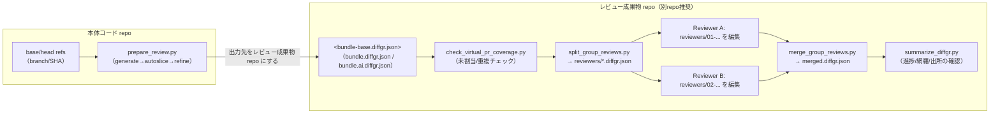
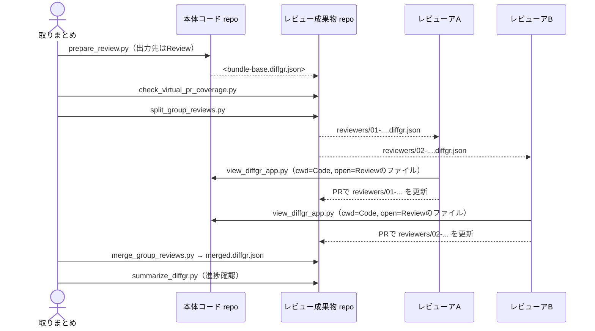
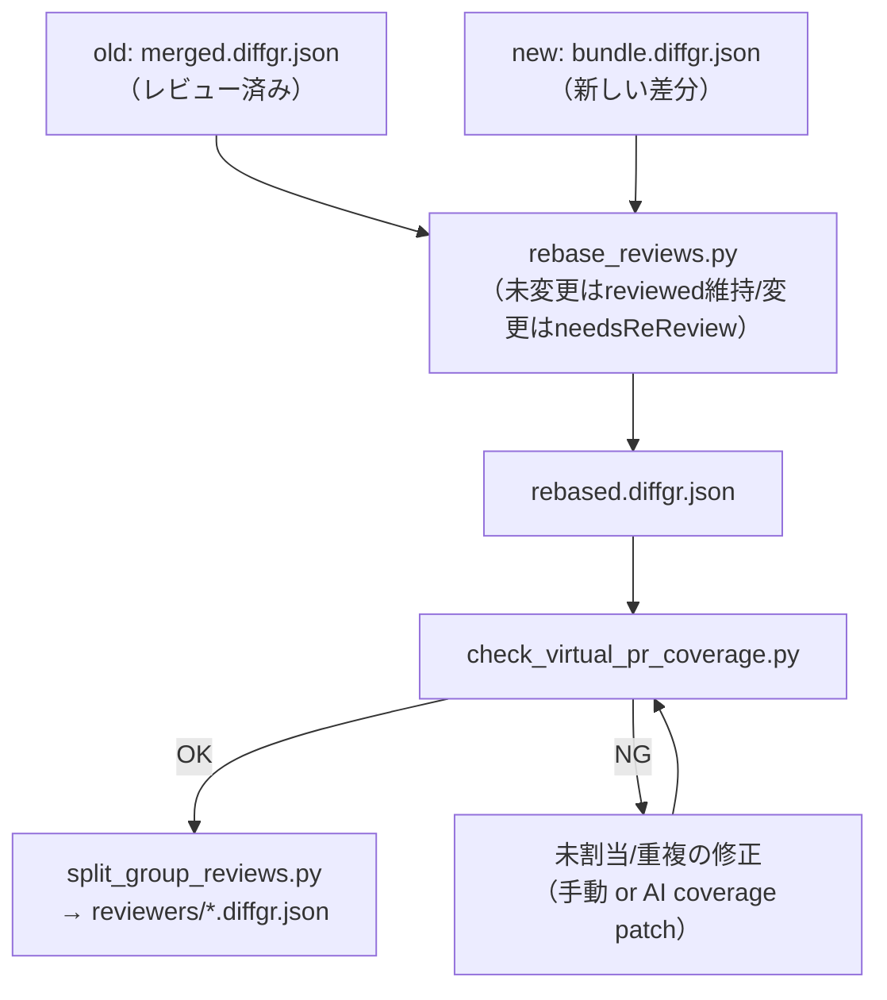
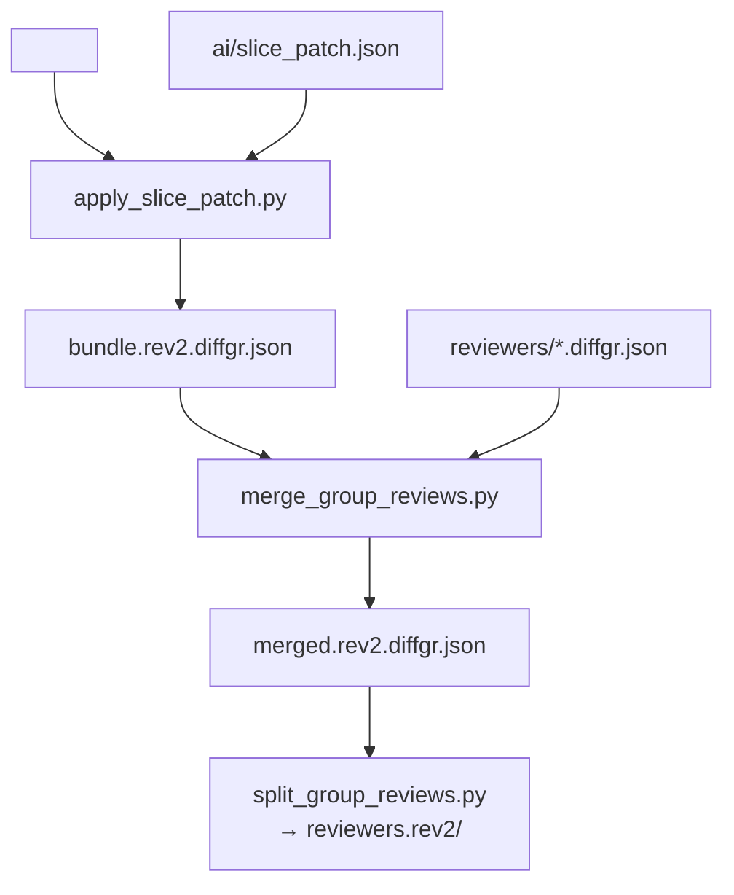

# レビュー成果物の Git 運用（別repo推奨）

DiffGR の `*.diffgr.json` は「差分スナップショット + レビュー状態 + コメント」を 1ファイルに集約できるため、
Git で履歴管理すると運用が安定します。

ただし本体コード repo に成果物を置くと:

- 本体 repo が汚れる（レビュー成果物はコードではない）
- レビューアが分かれると同時編集でコンフリクトしやすい

ので、レビュー成果物は **別repo（例: `your-repo-review`）** に集約する運用を推奨します。

---

## 1. 基本方針

- 本体コード repo: コードのみ（DiffGR の出力はコミットしない）
- レビュー成果物 repo: `*.diffgr.json` / AIパッチ / 最小限のメモのみをコミット
- 複数レビューア: **仮想PR（group）単位に 1ファイルずつ分割**して、担当者ごとに編集ファイルを分ける
- コード修正後: `rebase_reviews.py` で「未変更はreviewed維持、変更はneedsReReview」に寄せて再レビュー最小化

### 1.1 全体フロー（図）



補足:

- Textual UI の `o`（実ファイルを開く）を効かせるため、レビューは **本体コード repo ルートを cwd にして起動**します。
- レビュー成果物 repo は「diffgr の JSON だけ」を集約し、レビューア全員が同じ場所を参照できるようにします。

---

## 2. 推奨ディレクトリ構成（レビュー成果物 repo）

例:

```text
diffgr-reviews/
  bundles/
    <code-repo-name>/
      <bundle-id>/
        bundle.diffgr.json
        reviewers/
          manifest.json
          01-g-xxx-....diffgr.json
          02-g-yyy-....diffgr.json
        merged.diffgr.json
        ai/
          refine-prompt.md
          slice_patch.json
          coverage-fix-prompt.md
          coverage-fix.slice_patch.json
        bundle.md
```

`<bundle-id>` は最低限「いつ・どの差分か」が分かる文字列にします。

- 推奨: `YYYYMMDD-HHMMSS_<headSha短縮>` または `PR123_<headSha短縮>`

---

## 3. 何をコミットするか

### 3.1 コミット推奨（レビュー成果物 repo）

- `bundle.diffgr.json`
  - `--no-patch` を付けて生成し、サイズとノイズを減らすのを推奨
  - AIブラッシュアップを適用したものを配布ベースにするなら `bundle.ai.diffgr.json`
- `reviewers/*.diffgr.json`（分担レビューの成果物）
- `merged.diffgr.json`（最終集約）
- `ai/*.md` / `ai/*.json`（AIブラッシュアップの再現性）
- `bundle.md`（リンク・PR番号・注意点などの人間向けメモ）

### 3.2 コミット非推奨（原則）

- `out/` 配下（HTMLなどのビルド成果物）
  - 必要なら CI で生成するか、配布のみ（Git管理しない）
- `*.diffgr.json.bak`（Textual が作るバックアップ）

---

## 4. 作成者（取りまとめ役）の手順

以下は「本体コード repo を汚さず、成果物 repo にだけ保存」する手順です。

### 4.0 取りまとめの作業手順（図）



### 4.1 bundle ディレクトリを作る（レビュー成果物 repo）

レビュー成果物 repo で:

```powershell
mkdir bundles\<code-repo-name>\<bundle-id>\reviewers
mkdir bundles\<code-repo-name>\<bundle-id>\ai
```

### 4.2 DiffGR を生成して成果物 repo に出力（本体コード repo で実行）

本体コード repo のルートで実行（`filePath` が正しく解決されるため、後で `o` が効きやすい）:

```powershell
python <diffgr-repo>\scripts\prepare_review.py `
  --repo . `
  --base <base_ref_or_sha> `
  --feature <head_ref_or_sha> `
  --no-patch `
  --output <review-repo>\bundles\<code-repo-name>\<bundle-id>\bundle.diffgr.json `
  --title "DiffGR <code-repo-name> <bundle-id>"
```

補足:

- 生成された `bundle.diffgr.json` には `meta.source.baseSha/headSha/mergeBaseSha` が含まれます。
- `base/head` が ref 名でも、SHA が入るので「どのコミットか」を追跡できます。

任意（AIで仮想PRのrename/moveをブラッシュアップしたい場合）:

```powershell
# 1) AI用プロンプトを生成（markdown）
python <diffgr-repo>\scripts\refine_slices.py `
  --input <review-repo>\bundles\<code-repo-name>\<bundle-id>\bundle.diffgr.json `
  --output <review-repo>\bundles\<code-repo-name>\<bundle-id>\bundle.refined.diffgr.json `
  --write-prompt <review-repo>\bundles\<code-repo-name>\<bundle-id>\ai\refine-prompt.md

# 2) AIに slice_patch.json を作らせる（run_agent_cli の設定が必要）
python <diffgr-repo>\scripts\run_agent_cli.py `
  --config <diffgr-repo>\agent_cli.toml `
  --prompt <review-repo>\bundles\<code-repo-name>\<bundle-id>\ai\refine-prompt.md `
  --output <review-repo>\bundles\<code-repo-name>\<bundle-id>\ai\slice_patch.json `
  --interactive

# 3) 反映
python <diffgr-repo>\scripts\apply_slice_patch.py `
  --input <review-repo>\bundles\<code-repo-name>\<bundle-id>\bundle.refined.diffgr.json `
  --patch <review-repo>\bundles\<code-repo-name>\<bundle-id>\ai\slice_patch.json `
  --output <review-repo>\bundles\<code-repo-name>\<bundle-id>\bundle.ai.diffgr.json
```

以後の手順では、配布に使うベースとして `bundle.ai.diffgr.json` を採用します（AIを使わないなら `bundle.diffgr.json` のままでOK）。
このドキュメント以降の例では、配布に使うベースファイルを `<bundle-base.diffgr.json>` と表記します（実体は `bundle.diffgr.json` または `bundle.ai.diffgr.json`）。

### 4.3 事前チェック（網羅/未割当/重複）

```powershell
python <diffgr-repo>\scripts\check_virtual_pr_coverage.py `
  --input <review-repo>\bundles\<code-repo-name>\<bundle-id>\<bundle-base.diffgr.json>
```

NG なら `--write-prompt` で AI 修正プロンプトを作り、`apply_slice_patch.py` で直します。

### 4.4 分担用に group 単位で分割（レビュー成果物 repo に出力）

```powershell
python <diffgr-repo>\scripts\split_group_reviews.py `
  --input <review-repo>\bundles\<code-repo-name>\<bundle-id>\<bundle-base.diffgr.json> `
  --output-dir <review-repo>\bundles\<code-repo-name>\<bundle-id>\reviewers
```

### 4.5 初期コミット

レビュー成果物 repo で `<bundle-base.diffgr.json>` と `reviewers/*` をコミットします。

---

## 5. レビューアの手順（担当ファイルのみ編集）

### 5.1 本体コード repo を該当コミットに合わせる

レビュー成果物の `<bundle-base.diffgr.json>` の `meta.source.headSha` を使って、本体コード repo を checkout します。

### 5.2 Textual UI で担当ファイルを開く（本体コード repo ルートで実行）

`o` で実ファイルを開けるように、**本体コード repo ルートを cwd にして**起動します。

```powershell
python <diffgr-repo>\scripts\view_diffgr_app.py `
  <review-repo>\bundles\<code-repo-name>\<bundle-id>\reviewers\01-....diffgr.json `
  --ui textual
```

レビュー後は `s` で保存し、担当 `*.diffgr.json` だけをレビュー成果物 repo にコミット（PR推奨）します。

---

## 6. 取りまとめ（マージして最終成果物を作る）

レビュー成果物 repo に各 reviewer のファイルが揃ったら、取りまとめ役が `merged.diffgr.json` を生成してコミットします。

```powershell
python <diffgr-repo>\scripts\merge_group_reviews.py `
  --base <review-repo>\bundles\<code-repo-name>\<bundle-id>\<bundle-base.diffgr.json> `
  --input-glob "<review-repo>/bundles/<code-repo-name>/<bundle-id>/reviewers/*.diffgr.json" `
  --output <review-repo>\bundles\<code-repo-name>\<bundle-id>\merged.diffgr.json
```

---

## 7. コード修正後の再レビュー（差分だけ needsReReview）

1. 新しい差分スナップショット（round2）を作る（別 `bundle-id` 推奨）
2. `rebase_reviews.py` で前回の `merged.diffgr.json` を round2 に引き継ぐ
3. 以降は同様に分割して分担レビュー

例:

```powershell
# round2 を生成
python <diffgr-repo>\scripts\prepare_review.py `
  --repo . `
  --base <base_ref_or_sha> `
  --feature <new_head_ref_or_sha> `
  --no-patch `
  --output <review-repo>\bundles\<code-repo-name>\<bundle-id2>\bundle.diffgr.json `
  --title "DiffGR <code-repo-name> <bundle-id2>"

# 前回レビュー状態を引き継ぐ
python <diffgr-repo>\scripts\rebase_reviews.py `
  --old <review-repo>\bundles\<code-repo-name>\<bundle-id>\merged.diffgr.json `
  --new <review-repo>\bundles\<code-repo-name>\<bundle-id2>\bundle.diffgr.json `
  --output <review-repo>\bundles\<code-repo-name>\<bundle-id2>\rebased.diffgr.json `
  --history-label "fix-round2" `
  --history-actor "<review-coordinator>"
```

再レビュー（rebase）の流れ（図）:



再レビュー時の注意:

- `rebase_reviews.py` 既定では「旧 bundle の groups/assignments」を温存します（担当分担を維持したいとき向き）。
  - その代わり、新しく発生した chunk は unassigned になりがちなので、必ず網羅チェックを実行してください。
- 新bundleの groups/assignments を使いたい場合は `--keep-new-groups` を付けます（網羅性を優先したいとき向き）。
- `rebase_reviews.py` は既定で `meta.x-reviewHistory` に rebaseイベントを追記し、`meta.x-impactScope` に最新の影響範囲を保存します。
  - 履歴を残したくない場合のみ `--no-history` を使います。
  - 履歴サイズを抑えたい場合は `--history-max-ids-per-group` で groupごとの保持ID数を制限できます（既定: 200）。
  - `meta.x-impactScope.coverageNew` は rebase後の出力JSON（`rebased.diffgr.json`）を基準に計算されます。

```powershell
python <diffgr-repo>\scripts\check_virtual_pr_coverage.py `
  --input <review-repo>\bundles\<code-repo-name>\<bundle-id2>\rebased.diffgr.json
```

unassigned が出たら、次のどれかで対応します。

- Textual UI で手動割当（`a` で「選択chunkを選択groupへ割当」）
- AI に move だけ作らせて `apply_slice_patch.py` で反映（`check_virtual_pr_coverage.py --write-prompt`）
- まとまって増えた場合は「新bundle側の仮想PRを採用する」(`rebase_reviews.py --keep-new-groups`) に切り替える

### 7.1 「影響がない（再レビュー不要）」が見える化したい場合

`rebase_reviews.py` の後に、旧→新でどの group が影響を受けたかを Markdown で出力できます。

```powershell
python <diffgr-repo>\scripts\impact_report.py `
  --old <review-repo>\bundles\<code-repo-name>\<bundle-id>\merged.diffgr.json `
  --new <review-repo>\bundles\<code-repo-name>\<bundle-id2>\rebased.diffgr.json `
  --grouping old `
  --output <review-repo>\bundles\<code-repo-name>\<bundle-id2>\impact.md
```

読み方:

- `action=skip` の group は「旧bundleで存在した chunk については change が検出されなかった」= 原則再レビュー不要
- `action=review` の group は changed chunk があり、再レビュー候補
- `Unmatched New Chunks` がある場合は、まず割当（`check_virtual_pr_coverage.py` / `apply_slice_patch.py` / Textual手動割当）を済ませます

補足:

- Diff の文脈（context）だけが変わって add/delete が同一の場合は `delta` として扱い、レビュー済みステータスを維持します（行コメントは安全のため引き継ぎません）。
- `impact_report.py` は可視化レポート用、`meta.x-impactScope` は機械可読な最新スナップショットとして使う想定です。

---

## 8. `bundle.md` テンプレ（推奨）

```markdown
# DiffGR bundle

- code repo: <url or local path>
- PR: <link/number>
- base: <ref> (<baseSha>)
- head: <ref> (<headSha>)
- created: <createdAt>

## Notes
- reviewer assignment:
  - <group> -> <name>
```

---

## 9. Git運用（レビュー修正/反映の基本ルール）

別repo運用で「壊れにくい」ための最低限のルールです。

- `<bundle-base.diffgr.json>` は **差分スナップショット**（原則 read-only）
  - ここを書き換えると、全員の前提がズレます
- `reviewers/*.diffgr.json` は **レビュー入力（担当者が編集するファイル）**
  - 原則「1ファイル=1担当者（または1担当チーム）」にして競合を避けます
- `merged.diffgr.json` は **生成物（集約結果）**
  - 基本は取りまとめ役だけが作り直します
  - 実質「レビューの最新版」を参照したい人のためにコミットしておく価値はあります

### 9.1 ブランチ/PR例（おすすめ）

- 取りまとめ: `bundle/<bundle-id>`（初期bundle作成・分割まで）
- レビューア: `review/<bundle-id>/<group-id>-<name>`
- 取りまとめ（集約）: `merge/<bundle-id>`

レビュー成果物 repo では「レビューアは自分の `reviewers/*.diffgr.json` だけを編集する」ルールにすると、PRがきれいに分かれます。

### 9.2 レビュー成果物 repo の `.gitignore` 例

レビュー成果物 repo でも Textual の自動バックアップ（`.bak`）が作られます。成果物として不要なので無視推奨です。

```gitignore
*.diffgr.json.bak
out/
__pycache__/
.pytest_cache/
```

---

## 10. レビュー修正（コメント/ステータスの追記・訂正）

レビュー後に「やっぱりコメントを直したい」「doneを戻したい」等が発生した場合:

1. 修正したい担当 `reviewers/*.diffgr.json` を更新してコミット（PR推奨）
2. 取りまとめ役が main に取り込んだ後、`merge_group_reviews.py` をもう一度実行して `merged.diffgr.json` を作り直す

```powershell
python <diffgr-repo>\scripts\merge_group_reviews.py `
  --base <review-repo>\bundles\<code-repo-name>\<bundle-id>\<bundle-base.diffgr.json> `
  --input-glob "<review-repo>/bundles/<code-repo-name>/<bundle-id>/reviewers/*.diffgr.json" `
  --output <review-repo>\bundles\<code-repo-name>\<bundle-id>\merged.diffgr.json
```

ポイント:

- 「merged を手で直す」より「reviewers を直して再マージ」を基本にすると破綻しにくいです。

---

## 11. slice 修正（仮想PRのrename/move）を途中でやりたくなったら

原則は「配布前に slice を確定」です。ただ、どうしても途中で直したい場合は次で破綻を避けられます。

### 11.1 rename/move を反映し、既存レビューを引き継ぐ

1. `<bundle-base.diffgr.json>` に `apply_slice_patch.py` を適用して slice を更新
2. 既存の `reviewers/*.diffgr.json` を新bundleへマージしてレビュー状態を引き継ぐ
3. 必要なら再度 `split_group_reviews.py` で分割し直す（ファイル名が変わる場合がある）

例（同一bundle内に `rev2` として置く）:

```powershell
# 1) slice patch を適用
python <diffgr-repo>\scripts\apply_slice_patch.py `
  --input <review-repo>\bundles\<code-repo-name>\<bundle-id>\<bundle-base.diffgr.json> `
  --patch <review-repo>\bundles\<code-repo-name>\<bundle-id>\ai\slice_patch.json `
  --output <review-repo>\bundles\<code-repo-name>\<bundle-id>\bundle.rev2.diffgr.json

# 2) 既存レビューを引き継いだ merged を作る
python <diffgr-repo>\scripts\merge_group_reviews.py `
  --base <review-repo>\bundles\<code-repo-name>\<bundle-id>\bundle.rev2.diffgr.json `
  --input-glob "<review-repo>/bundles/<code-repo-name>/<bundle-id>/reviewers/*.diffgr.json" `
  --output <review-repo>\bundles\<code-repo-name>\<bundle-id>\merged.rev2.diffgr.json

# 3) 配布用に再分割（rev2）
python <diffgr-repo>\scripts\split_group_reviews.py `
  --input <review-repo>\bundles\<code-repo-name>\<bundle-id>\merged.rev2.diffgr.json `
  --output-dir <review-repo>\bundles\<code-repo-name>\<bundle-id>\reviewers.rev2
```

slice修正（rev2切り替え）の流れ（図）:



### 11.2 途中で直すときのルール

- 「rev2」等で新しいファイル/フォルダを切って、旧ファイルと混ぜない
- 取りまとめ役が「以後は rev2 を使う」宣言をする（レビューアが迷子になるのが一番きつい）

---

## 12. 進捗確認（CLI）

レビュー成果物 repo では JSON を直接開かずに、まずサマリで状況を見るのが安全です。

```powershell
python <diffgr-repo>\scripts\summarize_diffgr.py `
  --input <review-repo>\bundles\<code-repo-name>\<bundle-id>\merged.diffgr.json
```

CI や自動チェック用途なら `--json` で機械可読にできます。
