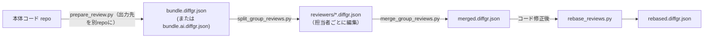

# DiffGR Viewer 実運用マニュアル

このドキュメントは、現行実装（2026-02-22 時点）に合わせた運用マニュアルです。  
対象は `scripts/` 配下の CLI と、`view_diffgr_app.py`（Textual UI）および HTML レポート運用です。

## 1. まず全体像

DiffGR 運用は次の4段階です。

1. `generate_diffgr.py` で差分JSONを作る
2. `autoslice_diffgr.py` / `refine_slices.py` / `apply_slice_patch.py` でレビューしやすい仮想PR構造に整える
3. `view_diffgr_app.py` でレビュー状態・コメントを編集する
4. HTMLレポート（静的またはローカルサーバ）で共有・追記する

主な入力/出力:

- 入力: Git の `base` / `feature` ref
- 中間/成果物: `*.diffgr.json`
- HTML成果物: `out/reports/*.html`

## 2. セットアップ

```powershell
cd F:\diffgr
python -m pip install -r requirements.txt
```

依存が不足すると Textual UI が起動できないため、最初に必ず実行します。

## 3. 最短クイックスタート

### 3.1 1コマンドでレビュー用 JSON を作る

```powershell
python scripts\prepare_review.py `
  --base samples/ts20-base `
  --feature samples/ts20-feature-5pr `
  --output samples/diffgr/ts20-5pr.review.diffgr.json `
  --title "DiffGR TS20 review bundle"
```

### 3.2 Textual UI でレビューする

```powershell
python scripts\view_diffgr_app.py samples/diffgr/ts20-5pr.review.diffgr.json
```

### 3.2.1 追加サンプル（実践的な差分でUI確認）

より実プロジェクトに近い「バックエンド/フロント/DB/CI/Docs/Tests」混在のサンプルです。

```powershell
python scripts\view_diffgr_app.py samples/diffgr/realistic-acme-tasks.diffgr.json --ui textual
```

### 3.3 HTML で共有する

```powershell
python scripts\export_diffgr_html.py `
  --input samples/diffgr/ts20-5pr.review.diffgr.json `
  --group all `
  --output out/reports/ts20-review.html `
  --open
```

## 4. スクリプト一覧（役割早見表）

- `scripts/generate_diffgr.py`: base/head から DiffGR JSON 生成
- `scripts/autoslice_diffgr.py`: コミット単位で仮想PRへ自動分割
- `scripts/refine_slices.py`: グループ名の日本語改善とAI用プロンプト出力
- `scripts/check_virtual_pr_coverage.py`: 仮想PR割当が全chunkを網羅しているか検査（AI修正プロンプト生成可）
- `scripts/run_agent_cli.py`: AIに `slice_patch.json` を作らせる支援
- `scripts/apply_slice_patch.py`: AI提案パッチ適用（rename/move）
- `scripts/split_group_reviews.py`: 仮想PR単位にレビューファイルを分割
- `scripts/merge_group_reviews.py`: 分割したレビューファイルを本体へマージ
- `scripts/rebase_reviews.py`: コード修正後の新DiffGRへレビュー状態を引き継ぐ（未変更は維持、変更はneedsReReview）
- `scripts/summarize_diffgr.py`: DiffGR JSON の進捗/網羅/出所（SHA含む）をサマリ表示
- `scripts/impact_report.py`: old/new の比較で「影響がある仮想PR/影響がない仮想PR」を見える化（Markdown/JSON出力）
- `scripts/prepare_review.py`: 生成→分割→改善まで一括
- `scripts/view_diffgr_app.py`: 対話ビューア（`textual`/`prompt`）
- `scripts/view_diffgr.py`: プロンプトUI系の入口
- `scripts/export_diffgr_html.py`: 静的HTMLレポートを出力
- `scripts/serve_diffgr_report.py`: HTML + 保存API をローカルサーバで提供

## 5. DiffGR の生成と分割

### 5.1 生JSONを作る

```powershell
python scripts\generate_diffgr.py `
  --base samples/ts20-base `
  --feature samples/ts20-feature-5pr `
  --output samples/diffgr/ts20-5pr.diffgr.json `
  --title "DiffGR TS20 sample"
```

### 5.2 自動分割（仮想PR化）

```powershell
python scripts\autoslice_diffgr.py `
  --base samples/ts20-base `
  --feature samples/ts20-feature-5pr `
  --input samples/diffgr/ts20-5pr.diffgr.json `
  --output samples/diffgr/ts20-5pr.autosliced.diffgr.json
```

### 5.3 分割名改善 + AI調整

```powershell
python scripts\refine_slices.py `
  --input samples/diffgr/ts20-5pr.autosliced.diffgr.json `
  --output samples/diffgr/ts20-5pr.refined.diffgr.json `
  --write-prompt samples/diffgr/ts20-5pr.refine-prompt.md
```

AI提案を作る:

```powershell
python scripts\run_agent_cli.py `
  --config agent_cli.toml `
  --prompt samples/diffgr/ts20-5pr.refine-prompt.md `
  --output slice_patch.json `
  --interactive
```

提案を適用:

```powershell
python scripts\apply_slice_patch.py `
  --input samples/diffgr/ts20-5pr.refined.diffgr.json `
  --patch slice_patch.json `
  --output samples/diffgr/ts20-5pr.ai-refined.diffgr.json
```

## 6. Textual UI 運用

起動:

```powershell
python scripts\view_diffgr_app.py samples/diffgr/ts20-5pr.ai-refined.diffgr.json
```

### 6.1 主要キー（実装準拠）

- `q`: 終了
- `/`: フィルタ入力へフォーカス
- `r`: フィルタリセット
- `g`: グループ表へフォーカス
- `c`: チャンク表へフォーカス
- `l`: 行表へフォーカス
- `n`: グループ新規作成
- `e`: グループ名変更
- `a`: 選択チャンクを選択グループへ割り当て
- `u`: 選択チャンクを未割り当て化
- `m`: コメント編集
- `d`: 右ペイン「通常表示」/「グループ差分一覧」切替
- `1`: `unreviewed`
- `2`: `reviewed`
- `3`: `needsReReview`
- `4`: `ignored`
- `[` / `]`: 左右ペイン比率変更
- `Alt+Left` / `Alt+Right`: 右ペイン内 old/new 幅比率変更
- `s`: JSON保存（初回に `.bak` 作成）
- `h`: HTMLエクスポート

### 6.2 コメント編集の仕様

- チャンク選択中に `m`: チャンクコメント編集
- 行選択中に `m`: 行アンカーコメント編集
- 空文字で確定すると該当コメントを削除

## 7. HTML レポート運用

HTMLは2方式あります。

1. 静的HTML方式
2. ローカルサーバ方式（直接保存対応）

### 7.1 静的HTML方式

```powershell
python scripts\export_diffgr_html.py `
  --input samples/diffgr/ts20-5pr.ai-refined.diffgr.json `
  --group "計算倍率変更" `
  --output out/reports/keisan-bairitsu.html `
  --open
```

`--group` はグループIDまたは日本語名（完全一致）。`all` も可。

静的HTML上でのコメント編集:

- `Comment`（チャンク）または `C`（行）で入力
- `Download JSON` で `draftDoc` 全体を書き出し
- `Copy Reviews` で `reviews` だけコピー

静的HTMLはファイルを自動更新しないため、最終反映は手動マージが必要です。

### 7.2 ローカルサーバ方式（推奨）

`Save to App` ボタンで `*.diffgr.json` の `reviews` を直接更新します。

```powershell
python scripts\serve_diffgr_report.py `
  --input samples/diffgr/ts20-5pr.ai-refined.diffgr.json `
  --group all `
  --open
```

動作:

- `http://127.0.0.1:8765/` にレポート表示
- `Save to App` で `/api/reviews` へPOST
- サーバが元JSONの `reviews` を更新して保存

注意:

- Textualアプリを起動中でも自動リロードはされない
- 反映確認は Textual 再起動または再読込で行う

### 7.3 `export_diffgr_html.py` で保存APIを埋め込む

任意エンドポイントに保存したい場合:

```powershell
python scripts\export_diffgr_html.py `
  --input samples/diffgr/ts20-5pr.ai-refined.diffgr.json `
  --group all `
  --output out/reports/live.html `
  --save-reviews-url http://127.0.0.1:8765/api/reviews `
  --save-reviews-label "Save to App"
```

この場合、静的ファイルでも `Save to App` ボタンが表示されます（エンドポイントが到達可能なときのみ成功）。

## 8. 推奨運用フロー

### 8.1 標準フロー

1. `prepare_review.py` でレビュー用JSON生成
2. `view_diffgr_app.py` で一次レビュー
3. `serve_diffgr_report.py` でHTML共有 + コメント追記
4. Textualで最終確認し `s` 保存

### 8.2 AIブラッシュアップ込み

このフローは「DiffGR を AI に渡して仮想PR分割を改善する」ための最短手順です。  
`samples/` は例なので、実運用では任意の `base` / `feature` と出力パスに置き換えてください。

#### 8.2.1 入出力のつながり（先に把握）

1. `01.diffgr.json` を作る（生DiffGR）
2. `02.autosliced.diffgr.json` を作る（自動分割）
3. `03.refined.diffgr.json` + `03.refine-prompt.md` を作る（AI入力準備）
4. AIで `04.slice_patch.json` を作る（rename/move提案）
5. `05.ai-refined.diffgr.json` を作る（最終適用結果）

#### 8.2.2 コピペ実行ブロック（PowerShell）

```powershell
# 作業ディレクトリ
cd F:\diffgr

# 出力フォルダ
New-Item -ItemType Directory -Force out\work | Out-Null

# 1) 生DiffGR生成
python scripts\generate_diffgr.py `
  --base <base_ref> `
  --feature <feature_ref> `
  --output out\work\01.diffgr.json `
  --title "DiffGR Review Bundle"

# 2) 自動分割
python scripts\autoslice_diffgr.py `
  --base <base_ref> `
  --feature <feature_ref> `
  --input out\work\01.diffgr.json `
  --output out\work\02.autosliced.diffgr.json

# 3) AI入力用に整形 + プロンプト出力
python scripts\refine_slices.py `
  --input out\work\02.autosliced.diffgr.json `
  --output out\work\03.refined.diffgr.json `
  --write-prompt out\work\03.refine-prompt.md

# 4) AIにslice_patch.jsonを作らせる
python scripts\run_agent_cli.py `
  --config agent_cli.toml `
  --prompt out\work\03.refine-prompt.md `
  --output out\work\04.slice_patch.json `
  --interactive

# 5) AI提案パッチ適用
python scripts\apply_slice_patch.py `
  --input out\work\03.refined.diffgr.json `
  --patch out\work\04.slice_patch.json `
  --output out\work\05.ai-refined.diffgr.json

# 6) 確認（Textual UI）
python scripts\view_diffgr_app.py out\work\05.ai-refined.diffgr.json --ui textual
```

#### 8.2.3 失敗しやすいポイント

- `run_agent_cli.py` 実行後に `04.slice_patch.json` が空/不正JSONの場合:
  - 再実行し、JSONのみ出力させる（説明文混在を避ける）
- `apply_slice_patch.py` で失敗する場合:
  - `04.slice_patch.json` が schema に合っているか確認する
  - `rename.from` / `move.from` が `03.refined.diffgr.json` の group/chunk ID と一致しているか確認する
- 途中成果物を目視確認したい場合:
  - `python scripts\view_diffgr_app.py out\work\03.refined.diffgr.json --ui textual`
  - `python scripts\view_diffgr_app.py out\work\05.ai-refined.diffgr.json --ui textual`

#### 8.2.4 仮想PRの網羅チェック（未割当/重複の検出）

AIでブラッシュアップ後、`assignments` の未割当や重複が残ることがあります。  
分担運用に入る前に、次で機械的に確認できます（OKなら exit code 0）。

```powershell
python scripts\check_virtual_pr_coverage.py --input out\work\05.ai-refined.diffgr.json
```

NG の場合（exit code 2）、AI修正用プロンプトを出して `slice_patch.json` で直せます。

```powershell
python scripts\check_virtual_pr_coverage.py `
  --input out\work\05.ai-refined.diffgr.json `
  --write-prompt out\work\coverage-fix-prompt.md

python scripts\run_agent_cli.py `
  --config agent_cli.toml `
  --prompt out\work\coverage-fix-prompt.md `
  --output out\work\coverage-fix.slice_patch.json `
  --interactive

python scripts\apply_slice_patch.py `
  --input out\work\05.ai-refined.diffgr.json `
  --patch out\work\coverage-fix.slice_patch.json `
  --output out\work\05b.coverage-fixed.diffgr.json
```

### 8.3 複数レビュアで仮想PR単位に分担

1つの `*.diffgr.json` を同時編集すると競合しやすいため、仮想PR単位に分割してレビューし、最後にマージします。

```powershell
# 0) 事前チェック（未割当や重複があれば直す）
python scripts\check_virtual_pr_coverage.py --input out\work\05.ai-refined.diffgr.json

# 1) 担当配布用に分割（1グループ=1ファイル）
python scripts\split_group_reviews.py `
  --input out\work\05.ai-refined.diffgr.json `
  --output-dir out\reviewers

# 2) 各レビュアが担当ファイルをレビュー
#    例: 1人目
python scripts\view_diffgr_app.py out\reviewers\01-<group>.diffgr.json --ui textual
#    例: 2人目
python scripts\view_diffgr_app.py out\reviewers\02-<group>.diffgr.json --ui textual

# 3) 全員分の結果を本体へ統合
python scripts\merge_group_reviews.py `
  --base out\work\05.ai-refined.diffgr.json `
  --input-glob "out/reviewers/*.diffgr.json" `
  --output out\work\06.merged-reviews.diffgr.json
```

運用注意:

- `manifest.json` はマージ入力に含めない（`*.diffgr.json` のみ指定する）
- 同一 chunk を複数レビュアが更新した場合、後勝ちで上書きされる

### 8.4 レビュー後にコード修正した場合（再レビュー最小化）

レビューコメントを反映してコードを修正すると、新しい `base`/`feature` の差分では chunk id が変わりがちです。  
そのまま新しい DiffGR を作ると「全て未レビュー扱い」になりやすいので、前回のレビュー状態を引き継いで再レビュー対象を絞ります。

やること:

1. 新しい差分スナップショット（`r2.review.diffgr.json`）を作る
2. `rebase_reviews.py` で前回 state を引き継ぐ（未変更は `reviewed` 維持、変更は `needsReReview`）
3. `check_virtual_pr_coverage.py` で未割当/重複がないか確認する

```powershell
# 例: round2 を作る（generate/autoslice/refine でもOK）
python scripts\prepare_review.py `
  --base <base_ref> `
  --feature <new_feature_ref> `
  --output out\work\r2.review.diffgr.json `
  --title "DiffGR Review Bundle (round2)"

# 前回レビューの state を引き継ぐ
python scripts\rebase_reviews.py `
  --old out\work\05.ai-refined.diffgr.json `
  --new out\work\r2.review.diffgr.json `
  --output out\work\r2.rebased.diffgr.json

# 未割当/重複がないか確認
python scripts\check_virtual_pr_coverage.py --input out\work\r2.rebased.diffgr.json

# 再レビュー（reviewed維持された部分はスキップできる）
python scripts\view_diffgr_app.py out\work\r2.rebased.diffgr.json --ui textual
```

調整:

- 変更検出の感度を上げたい場合は `rebase_reviews.py --similarity-threshold 0.78` のように下げる  
  ただし下げすぎると別chunkを誤って紐付けるリスクが上がる
- `rebase_reviews.py` は既定で `meta.x-reviewHistory`（履歴）と `meta.x-impactScope`（最新影響範囲）を更新する
  - 追記ラベルを残す場合: `--history-label "fix-round2" --history-actor "alice"`
  - 履歴1件あたりの保持ID数を絞る場合: `--history-max-ids-per-group 100`
  - 履歴追記を無効化したい場合: `--no-history`
  - `meta.x-impactScope.coverageNew` は rebase後の出力JSONを基準に計算される

### 8.5 レビュー成果物の Git 運用（別repo推奨）

本体コード repo に `*.diffgr.json` やレビューファイルを置くと、成果物で repo が汚れたり、複数レビュアで競合しやすくなります。  
レビュー成果物は別repoに集約し、`split_group_reviews.py`（分割）→ 各レビューアが担当ファイルだけ編集 → `merge_group_reviews.py`（統合）で運用するのを推奨します。



詳細は `docs/review_repo_workflow.md` を参照してください。

## 9. トラブルシュート

- `textual UI is unavailable`
  - `python -m pip install -r requirements.txt`
  - 代替: `python scripts\view_diffgr_app.py <file> --ui prompt`

- HTMLでコメント入力しても保存されない
  - 静的HTML方式は自動反映しない。`Download JSON` 後に手動マージする
  - 直接保存したいなら `serve_diffgr_report.py` を使う

- `Save to App` が出ない
  - レポートに保存URLが埋め込まれていない
  - `serve_diffgr_report.py` 経由で開くか `--save-reviews-url` 付きで再出力する

- `Uncaught SyntaxError ... unescaped line break`
  - 古いHTML資産を使っている可能性が高い
  - 最新コードでHTMLを再生成する

- JSON破損/誤保存
  - Textual保存時の `.bak` を復元する
  - Git管理下なら `git diff` で `reviews` 差分を確認して戻す
